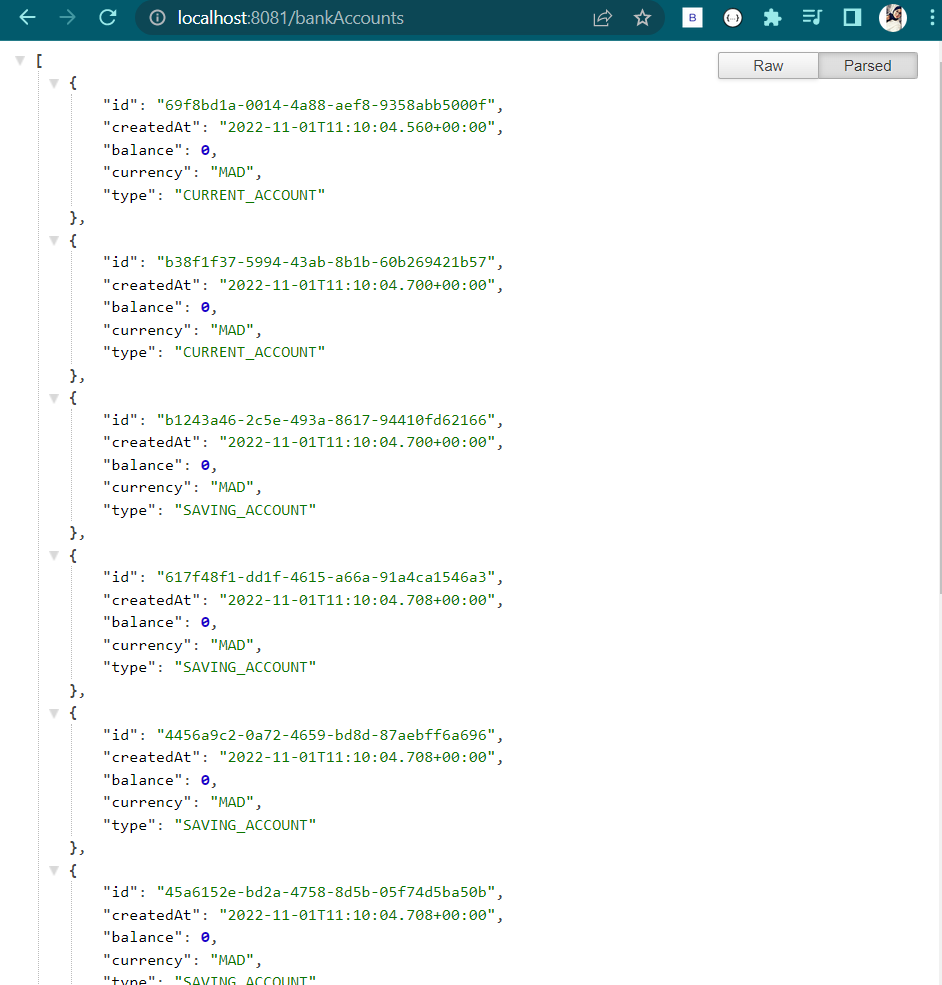
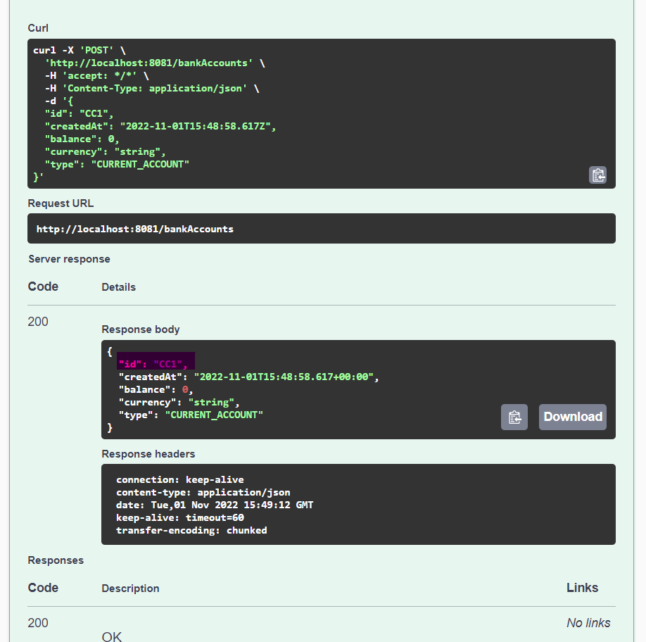

<h1>Création d'un Micro service REST Connector</h1>
<h1>Introduction</h1>
Le but de ce project de créer un  micro service qui permet des gérer des comptes bancaires avec <strong>Spring boot</strong>
<h1>Concept Générale :</h1>
<h3>Architecture micro Services :</h3>

<h1>Concept de la l'application :</h1>
<h5>1. Créer un projet Spring Boot avec les dépendances Web, Spring Data JPA, H2, Lombok
<h5>2. Créer l'entité JPA Compte
<h5>3. Créer l'interface CompteRepository basée sur Spring Data
<h5>4. Tester la couche DAO
<h5>5. Créer le Web service Restfull qui permet de gérer des comptes
<h5>6. Tester le web micro-service en utilisant un client REST comme Postman
<h5>7. Générer et tester le documentation Swagger de des API Rest du Web service
<h5>8. Exposer une API Restful en utilisant Spring Data Rest en exploitant des projections
<h5>9. Créer les DTOs et Mappers
<h5>10. Créer la couche Service (métier) et du micro service
<h3>Architecture de l'application </h3>

<h3>La démarche de création: </h3>
En fait on a deux manières pour créer ce projet :
la premèire c'est de le faire à partir d'un IDE
la deuxième c'est de le créer à partir de site web <strong>spring initializr</strong> <a>https://start.spring.io/</a> 
<h4>les étapes à suivre:</h4>

En suite les spéfications : 

Les dépendances :

<h1>Simmulation :</h1>
<h3>un test avec h2 console </h3>

<h3>un simple test pour les comptes bancaire</h3>

<h3>Un test d'un compte avec son id</h3>

<h3>Un test des comptes bancaire avec outil <strong>Postman</strong></h3>

<h3>Un test d'application avec outil <strong>Swagger</strong></h3>

<h3> Format json api-docs</h3>

<h3>Un test pour chercher par find by type </h3>

<h3>POM.XML :</h3>
Après définitions des models. il faut vérifier dans le fichier xml les dépendences suivantes :

